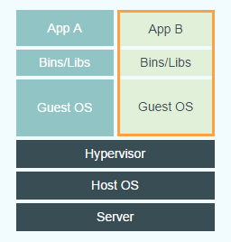
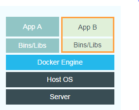
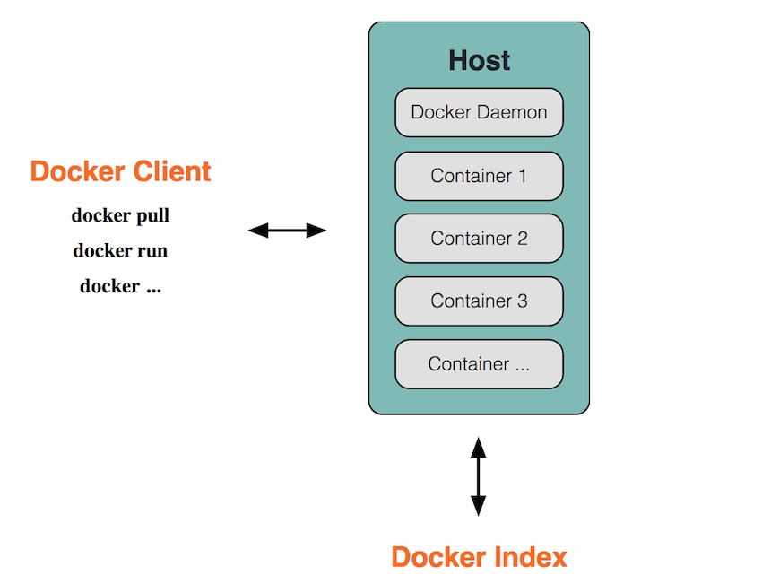

# Docker介绍

## 是什么

1. Go 语言开发，开源：（[nextcloud/docker](https://github.com/nextcloud/docker)）
2. 可以将应用包装在Linux容器中运行的工具
3. 基于Docker的沙箱环境可以实现轻型隔离，容器之间互不影响

## 用途

1. **提供一次性环境：**单元测试和构建环境、软件运行环境
2. **提供弹性云服务：**Docker容器适合动态扩容和缩容
3. **组建微服务架构：**

## 和虚拟机区别

### 虚拟机

- 基础设施：个人电脑、数据中心服务器、云主机
- 虚拟机管理系统（Hypervisor）
  - Type-1: MacOS的HyperKit, 支持windows的Hyper-V, Xen 以及 KVM
  - Type-2: VisualBox和VMWare workstation
- 客户机操作系统（Guest OS）
- 依赖：各个客户机系统都要安装许多依赖，不能共用
- 应用

### Docker

- 基础设施
- 主机操作系统：
- Docker守护进程(Docker Daemon): Docker 守护进程取代了Hypervisor, 是运行在操作系统桑的后台进程，负责管理Docker容器
- 依赖： 所以依赖打包在Docker镜像中，Docker容器基于Docker镜像创建
- 应用

### 两者对比

1. docker启动快（秒级别）；
2. docker所需资源少，docker在操作系统级别进行虚拟化，docker容器和内核交互性能由于Hypervisor层与内核层的虚拟化；
3. docker更轻量，docker架构可以共用一个内核与共享引用程序库，占内存小，系统利用率高；
4. docker隔离性更弱（进程间隔离），虚拟机是系统级别隔离
5. docker安全性更弱，docker的root和宿主root等同，容器内root权限也具备宿主机的root权限。虚拟机用户root权限和宿主机root虚拟机权限是分离的。而且虚拟机利用Intel的VT-d和VT-x的ring-1硬件隔离技术，可以防止虚拟机突破和彼此交互。docker容器没有任何形式硬件隔离，容易受攻击。
6. 可管理性：docker集中化管理工具不成熟（现在呢？）。各种虚拟化技术都有成熟的管理工具，例如  VMWare vCenter；
7. 高可用性和可恢复性：docker对业务的高可用支持是通过快速重新部署实现。虚拟化具备负载均衡，高可用，容错，迁移和数据保护等；（？）
8. 快速创建和删除：虚拟化创建是分钟级别，docker容器创建是秒级别（快速迭代性）
9. 交互、部署：虚拟机可以通过镜像实现环境交互一致性，但镜像分发无法体系化。Docker在dockerfile中记录容器构建过程，可在集群中实现快速分发和快速部署。

### Docker vs OpenStack(类似VMWare的Iaas产品)

|类别|Docker|OpenStack|
|:--:|:--:|:--:|
|部署难度|非常简单|组件多|
|启动速度|秒级|分钟级|
|执行性能|和物理系统几乎一致|VM会占用一些资源|
|镜像体积|镜像是MB级别|虚拟机镜像GB级别|
|管理效率|管理简单|组件相互依赖，管理复杂|
|隔离性|各理性相对较高|彻底隔离|
|可管理性|单进程，不建议启动SSH|完整的系统管理|
|网络连接|比较弱|借助Neutron可以灵活组件各类网络架构|

## 容器技术严格来说不是虚拟化

没有客户机操作系统且是共享内核的。容器可以视为软件供应链的集装箱，能够把应用需要的运行环境、缓存环境、数据库环境等等封装起来，以最简洁的方式支持应用运行，轻装上阵，当然是性能更佳。Docker镜像特性则让这种方式简单易行。当然，因为共享内核，容器隔离性也没有虚拟机那么好。

## Docker Component

Docker是CS架构，主要由下面三部分组成：

1. Docker daemon: 运行在宿主机上的守护进程， 用户通过Docker client与Doccker daemon交互
2. Docker client: Docker 命令行工具，还可以通过socker或者RESTful API访问远程的Docker daemon;
3. Docker hub/registry: 共享和管理Docker镜像，官方地址：<https://registry.hub.docker.com/>，可以上传或下载镜像也可以自己搭建私有 Docker registry

## Docker image & Docker container

- Docker image: 镜像包含有需要运行的文件，镜像是只读的。镜像用来创建container。镜像可以通过 Dockerfile 创建， 也可以从 Docker hub/registry 下载。
- Docker container: 容器是Docker的运行组件，启动一个镜像就是一个容器，容器是隔离环境，多个容器之间互不影响，保证容器中的程序运行在一个**相对**安全的环境中。（参考和虚拟机对比的第5点）
