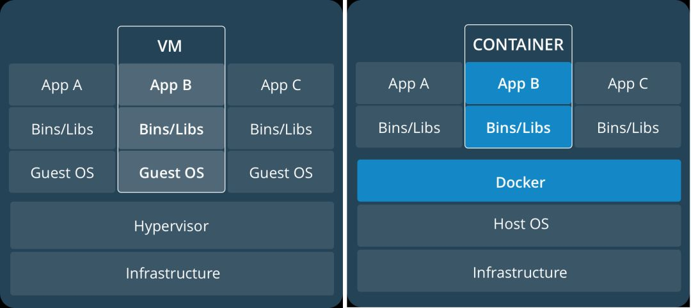

# Docker资源隔离和限制

## Docker 容器实现



虚拟机实现资源隔离的方法是利用一个独立的Guest OS,并利用Hypervisor虚拟化CPU，内存，IO设备等实现的。
Docker是利用Linux内核特性实现的隔离，运行容器的速度几乎等同于直接启动进程。

### Docker的实现原理：

- 使用`Namespaces`实现系统环境的隔离，`Namespaces`允许一个进程以及它的子进程从共享的宿主机内核资源（网络栈、进程列表、挂载点等）里获得一个仅自己可见的隔离区域，让同一个Namespace下的所有进程感知彼此变化，对外界进程一无所知，仿佛运行在一个独占的操作系统中；
- 使用CGroups限制这个环境的资源使用情况，比如限制容器使用2核4GB。使用CGroups还可以为资源设置权重，计算使用量，操控任务（进程或线程）启停等；
- 使用镜像管理功能，利用Docker的镜像分层、写时复制、内容寻址、联合挂载技术实现了一套完整的容器文件系统以及运行环境，再结合镜像仓库，镜像可以快速下载和共享，方便在多环境部署。

### 存在的问题

1. Docker是利用CGroups实现资源限制的，只能限制资源消耗的最大值，而不能隔绝其它程序占用自己的资源。
2. Namespace的6项隔离看似完整，实际上依旧没有隔离Linux资源，比如/proc,/sys, /dev/sd* 等目录未完全隔离，SELinux、time、sysLog等所有现有Namespace之外的信息都未隔离。

## 容器隔离问题&解决方法

1. 在Docker容器中执行`top`,`free`等命令，看到的资源使用情况都是宿主机的使用情况，而我们需要的是当前这个容器被限制了多少CPU,内存,以及当前容器内的进程；
2. 在容器里修改 `/etc/sysctl.conf`,会收到提示：`sysctl: error setting key 'net.ipv4...': Read-only file system`;
3. 程序运行在容器里面，调用API获取系统内存、CPU，获取到的是宿主机的资源大小
4. 对于多进程程序，一般可以将worker数量设置成auto,自适应系统CPU核数，但在容器里面这么设置，取到的CPU核数是不正确的，例如Nginx, 其它应用取到的可能也是不正确的，需要进行测试。

这些问题的本质都一样，在Linux环境中，很多命令都是通过读取 /proc/ 或者 /sys 目录下文件来计算资源使用情况，包括各个语言（Java, Nodejs），是通过 /proc/meminfo或其它相似的文件获取内存信息。

JVM默认的最大Heap大小是系统内存的1/4，加入物理内存为10G，不指定Heap大小时，JVM默认Heap大小就是2.5G。JavaSE8(<8u131)版本前还没有针对在容器内执行高度受限的Linux进程进行优化，JDK1.9 以后开始正式支持容器环境中的CGroups内存限制，JDK1.10 这个功能已经默认开启，可以查看相关Issue（Issue地址：<https://bugs.openjdk.java.net/browse/JDK-8146115>）。熟悉JVM内存结构的人都清楚，JVM Heap是一个只增不减的内存模型，Heap的内存只会往上涨，不会下降。在容器里面使用Java，如果为JVM未设置Heap大小，Heap取得的是宿主机的内存大小，当Heap的大小达到容器内存大小时候，就会触发系统对容器OOM，Java进程会异常退出。常见的系统日志打印如下：

```log
memory: usage 2047696kB, limit 2047696kB, failcnt 23543
memory+swap: usage 2047696kB, limit 9007199254740991kB, failcnt 0
......
Free swap = 0kB
Total swap = 0kB
......
Memory cgroup out of memory: Kill process 18286 (java) score 933 or sacrifice child
```

两种办法设置Heap

1. 对于JavaSE8(<8u131)版本，手动指定最大堆大小，docker run的时候通过环境变量传参确切限制最大Heap大小：

    ```sh
    docker run -d -m 800M -e JAVA_OPTIONS='-Xmx300m' openjdk:8-jdk-alpine
    ```

1. 对于JavaSE8(>8u131)版本，可以使用手动指定，也可以使用下面的办法自适应容器内存限制：

    ```sh
    docker run -d -m 800M -e JAVA_OPTIONS='-XX:+UnlockExperimentalVMOptions -XX:+UseCGroupMemoryLimitForHeap'
    ```

## “参考”地址

1. <http://dockone.io/article/8148>
