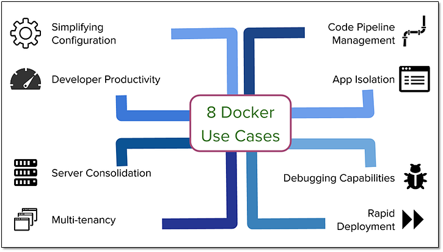

# Docker 使用场景

## 1. 简化配置

虚拟机能让用户硬件设施上运行各种配置不一样的平台（软件、系统），Docker在降低额外开销的情况下提供了同样的功能。可以让用户将运行环境和配置放在代码中然后部署，同一个Docker配置可以在不同环境中使用，降低了硬件要求和应用环境之间耦合度。

## 2. 代码流水线（Code Pipeline）管理

代码从开发环境到生产环境部署，需要经过很多中间环境，每个中间环境都可能有微小差别，Docker给应用提供了一个从开发到上线均一致的环境，让代码流水线变得更简单。

## 3. 提高开发效率

## 4. 隔离应用

降低成本而进行服务器整合
将一个单体应用才分成松耦合的单个服务（微服务架构）

使用Docker容器就可以在同一台机器上运行不同的服务，且互相隔离。

## 5. 整合服务器

正如通过虚拟机来整合多个应用，Docker隔离应用能力使得Docker可以整合多个服务器以降低成本。
由于Docker没有像虚拟机一样存在多个操作系统内存占用， 以及能在多个实例之间共享没用使用的内存，Docker可以比虚拟机提供更好的整合解决方案。

## 6. 调试能力

Docker 提供了很多工具，这些工具不一定只是针对容器，但适用于容器。它们提供了很多功能，包括：为容器设置检查点、设置版本和查看两个容器差别，这些特性可以帮助调试Bug. 参考[这里](http://flux7.com/blogs/docker/docker-saves-the-day-at-flux7/)

## 7. 多租户环境

另外一个Docker有意思的使用场景是在多租户的应用中，它可以避免关键应用的重写。我们一个特别的关于这个场景的例子是为IoT（物联网）的应用开发一个快速、易用的多租户环境。这种多租户的基本代码非常复杂，很难处理，重新规划这样一个应用不但消耗时间，也浪费金钱。

使用Docker，可以为每一个租户的应用层的多个实例创建隔离的环境，这不仅简单而且成本低廉，当然这一切得益于Docker环境的启动速度和其高效的diff命令。

## 8. 快速部署

在虚拟机之前，引入新的硬件资源需要消耗几天的时间。虚拟化技术（Virtualization）将这个时间缩短到了分钟级别。而Docker通过为进程仅仅创建一个容器而无需启动一个操作系统，再次将这个过程缩短到了秒级。这正是Google和Facebook都看重的特性。

你可以在数据中心创建销毁资源而无需担心重新启动带来的开销。通常数据中心的资源利用率只有30%，通过使用Docker并进行有效的资源分配可以提高资源的利用率
